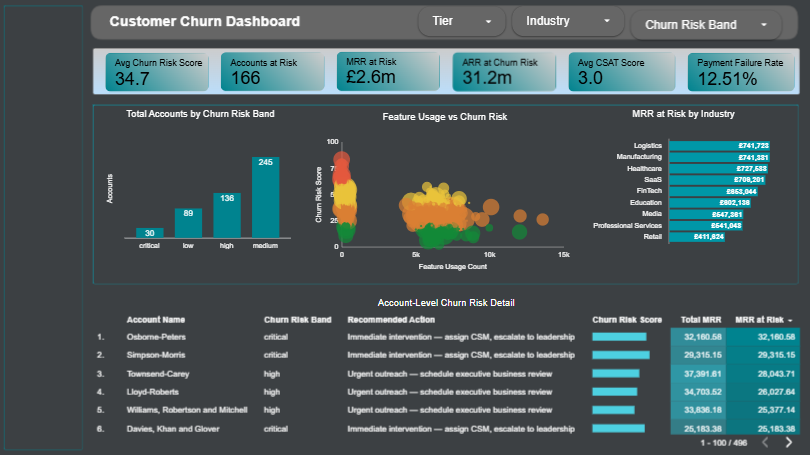
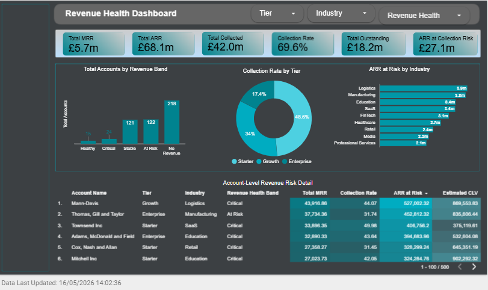
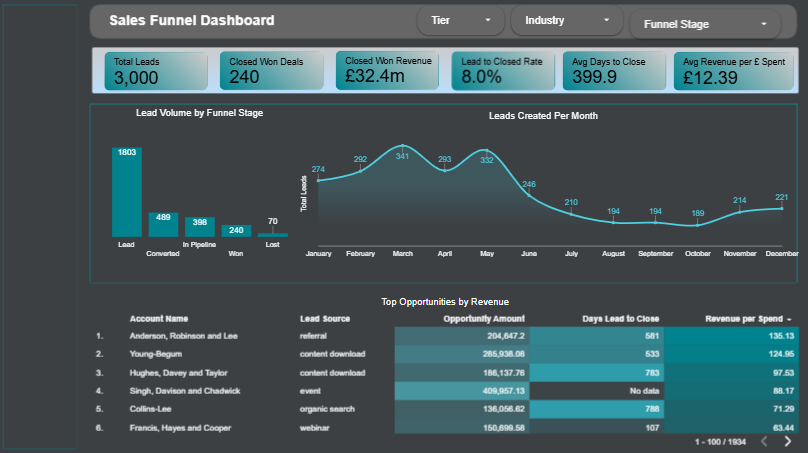
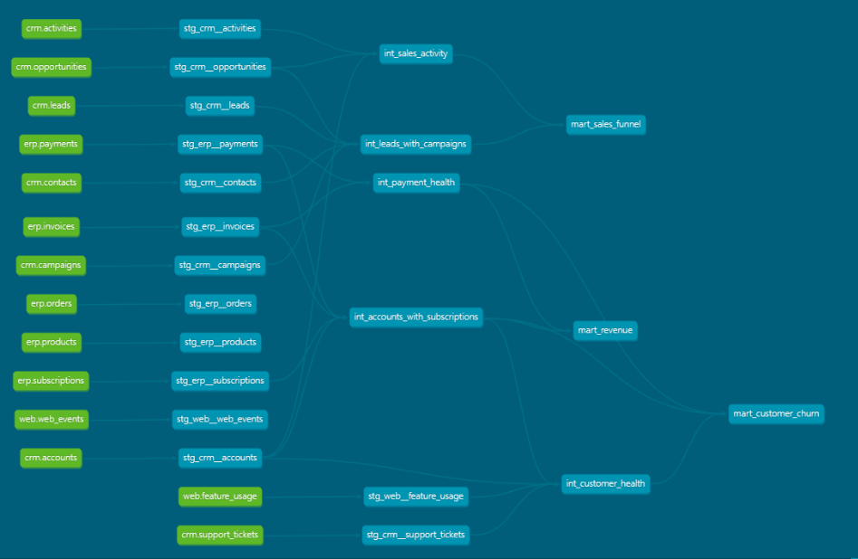

# Revenue Intelligence Platform on GCP

> An end-to-end analytics pipeline on GCP that ingests CRM, ERP, and web event data to surface customer churn risk, revenue health, and sales funnel performance. Built with Airbyte, BigQuery, dbt Core, and Looker Studio. 14 staging models, 5 intermediate models, 3 mart tables, and 95 automated tests covering both structural and behavioural data validation.

---

## Live Dashboard

🔗 **[View the live Looker Studio dashboard](https://datastudio.google.com/reporting/c5270921-d001-40d0-8e88-46d3bea81199)**

---

## Table of Contents

- [About the Project](#about-the-project)
- [Objective](#objective)
- [Approach](#approach)
- [Results](#results)
- [Dashboards](#dashboards)
- [Architecture](#architecture)
- [Data Model](#data-model)
- [Pipeline Layers](#pipeline-layers)
- [Data Quality and Testing](#data-quality-and-testing)
- [Tech Stack](#tech-stack)
- [Project Structure](#project-structure)
- [How to Run](#how-to-run)
- [Future Enhancements](#future-enhancements)

---

## About the Project

The Revenue Intelligence Platform is a production-pattern, end-to-end modern data stack project built for a B2B SaaS business. It demonstrates the full analytics engineering workflow from raw source data through ingestion, multi-layer transformation, automated testing, and live dashboard visualisation.

The platform combines CRM data (HubSpot), ERP data (ERPNext), and web event data (GA4) into a unified analytical layer that answers three critical revenue questions: which customers are at risk of churning, where revenue is being lost in the billing cycle, and which leads are most likely to convert through the sales funnel.

The architecture follows a strict separation of concerns. Each layer has one responsibility. Ingestion moves data faithfully. Staging cleans and standardises. Intermediate computes business logic. Marts serve precomputed, tested, trusted tables to the visualisation layer. By the time data reaches a dashboard, it has passed 95 automated quality checks across structural integrity and behavioural invariants.

This is the type of pipeline used by mid-sized to enterprise B2B SaaS data teams, condensed into a portfolio-friendly format that runs entirely on free-tier GCP services.

---

## Objective

To design and build a fully tested, end-to-end analytics pipeline that surfaces three critical revenue insights for a B2B SaaS business:

1. **Customer churn risk** — a quantified risk score per account combining payment health, support ticket signals, and product usage patterns
2. **Revenue health** — billing collection rates, outstanding revenue exposure, and customer lifetime value across the customer base
3. **Sales funnel performance** — full lead-to-revenue attribution with deal velocity, campaign ROI, and conversion analysis

The goal was to produce a single trusted analytical layer that business stakeholders can interrogate through a live dashboard without relying on ad hoc SQL queries or manual reporting.

---

## Approach

The project follows modern data stack architectural conventions across four distinct pipeline layers, each with a single responsibility.

**Source data** was generated using a Python script that produces 118,430 rows across 14 tables spanning CRM, ERP, and web event domains. Realistic dirty data patterns were deliberately introduced to simulate production data quality conditions — orphaned records, inverted date ranges, repeat payment failures, low CSAT scores, missing conversion timestamps, and inconsistent categorical casing.

**Ingestion** brings raw source data into BigQuery RAW datasets via Airbyte using a GCS staging bucket as the landing zone. No transformations or business logic are applied at this layer.

**Transformation** is handled entirely by dbt Core across three model layers:

- **Staging** (14 models, materialised as views) — one model per source table. Casts data types, standardises categorical fields, and surfaces dirty data as derived boolean flags including `is_orphaned`, `is_date_inverted`, `is_low_csat`, `is_repeat_failure`, `is_high_touch`, and `is_conversion_date_missing`.

- **Intermediate** (5 models, materialised as views) — computes business logic once and reuses it across mart models. Includes a multi-signal churn risk scoring model, a payment health timeline with consecutive failure detection, sales engagement intensity per opportunity, and the full lead-to-campaign-to-opportunity attribution chain.

- **Marts** (3 tables, materialised as BigQuery tables) — final analytical layer that powers the dashboards directly. Organised into three business domains: core (customer churn), finance (revenue), and marketing (sales funnel).

**Visualisation** is delivered through Looker Studio with three dedicated report pages, each consuming one mart table. The visualisation layer does zero computation — every metric has already been calculated, tested, and validated upstream.

**Testing** is enforced through 95 automated dbt tests covering both structural data validation (uniqueness, not nulls, accepted values, referential integrity) and behavioural data invariants (temporal ordering, business logic assertions) using the dbt_utils package.

---

## Results

| Outcome | Metric |
|---------|--------|
| Source tables modelled | 14 |
| Rows ingested across all tables | 118,430 |
| Staging models built | 14 |
| Intermediate models built | 5 |
| Mart tables materialised | 3 |
| Automated data tests | 95 |
| Test categories covered | Structural and behavioural |
| Test runtime | Under 60 seconds |
| Dashboard pages delivered | 3 |
| Dirty data patterns flagged | 7 |
| Pipeline layers | 4 |

The platform produces three production-grade analytical outputs:

- A churn risk score (0 to 100) per account with MRR and ARR at risk quantified by risk band, alongside a recommended action per account
- A revenue health classification per account combining collection rate, payment health, and subscription status with estimated customer lifetime value
- A full sales funnel view tracking every lead through campaign attribution, conversion, opportunity stage, and closed won outcome, with deal velocity and campaign ROI

---

## Dashboards

### Customer Churn Dashboard

The customer churn dashboard surfaces account-level churn risk by combining payment health, support ticket signals, and feature usage adoption. Includes a bubble chart visualising five metrics simultaneously: feature usage, churn risk score, total MRR, churn risk band, and account name. Account-level detail table shows the highest risk accounts with their recommended retention action.



### Revenue Health Dashboard

The revenue health dashboard tracks billing collection rates, outstanding revenue, and ARR exposure across the customer base. Account-level detail table with heatmap colour scales surface the accounts most at risk of revenue loss based on collection performance.



### Sales Funnel Dashboard

The sales funnel dashboard delivers full lead-to-revenue tracking from lead creation through campaign attribution, conversion, pipeline stage, and closed won outcome. Includes time series analysis of leads created per month, conversion rates by lead source, and the top closed won opportunities by revenue.



---

## Architecture

```
SOURCE SYSTEMS          INGESTION        STORAGE         WAREHOUSE
──────────────          ─────────        ───────         ─────────
HubSpot (CRM)   ──┐
ERPNext (ERP)   ──┼──  Airbyte  ──────  GCS bucket  ──  BigQuery RAW
GA4 (web events)──┘

                                                              │
                                                         dbt staging
                                                              │
                                                      dbt intermediate
                                                              │
                                                         dbt marts
                                                              │
                                                       Looker Studio
```

---

## Data Model

14 source tables across three domains:

| Domain | Tables |
|--------|--------|
| CRM (HubSpot) | accounts, contacts, leads, opportunities, activities, campaigns, support_tickets |
| ERP (ERPNext) | products, orders, invoices, subscriptions, payments |
| Web (GA4) | web_events, feature_usage |

### Deliberate data quality issues introduced

| Issue | Table | Flag |
|-------|-------|------|
| Contacts with no linked account | contacts | is_orphaned |
| Converted leads with no converted_at | leads | is_conversion_date_missing |
| Subscriptions where end_date < start_date | subscriptions | is_date_inverted |
| Activities with null activity_date | activities | is_date_missing |
| Support tickets with no CSAT score | support_tickets | flagged in derived column |
| Consecutive failed payments | payments | is_repeat_failure |
| Inconsistent utm_source casing | web_events | standardised in staging |

---

## Pipeline Layers

### Staging (14 models — views)

One model per source table. Responsibilities:
- Cast all columns to correct data types
- Standardise categorical fields using LOWER(TRIM())
- Rename columns to project conventions
- Derive dirty data flags as boolean columns
- No joins, no aggregations, no business logic

Organised into three subfolders matching source domains.

### Intermediate (5 models — views)

| Model | Purpose |
|-------|---------|
| int_accounts_with_subscriptions | Account-level subscription, invoice, and payment aggregations |
| int_customer_health | Multi-signal churn risk scoring per account |
| int_payment_health | Payment timeline analysis with consecutive failure detection |
| int_sales_activity | Sales engagement intensity per opportunity |
| int_leads_with_campaigns | Lead-to-campaign-to-opportunity attribution chain |

### Marts (3 tables — materialised tables)

| Model | Folder | Purpose |
|-------|--------|---------|
| mart_customer_churn | marts/core | Churn risk score, MRR/ARR at risk, recommended actions per account |
| mart_revenue | marts/finance | Revenue health classification, collection rate, CLV, expansion flags |
| mart_sales_funnel | marts/marketing | Funnel conversion, deal velocity, campaign ROI, engagement quality |

---

## dbt Documentation and Lineage

The full dbt project documentation is auto-generated from model SQL files and schema.yml descriptions. The lineage graph below shows the complete data flow across the pipeline, from raw source tables through staging and intermediate transformations to the final mart tables that power the dashboards.



To regenerate the documentation site locally:

```bash
dbt docs generate
dbt docs serve
```

This builds a browsable static site at `http://localhost:8080` with every model documented, including compiled SQL, column descriptions, test results, and an interactive lineage explorer.

---

## Data Quality and Testing

95 automated dbt tests across all three model layers, all passing.

| Test Type | Category | What it Validates |
|-----------|----------|-------------------|
| unique | Structural | Primary keys are unique |
| not_null | Structural | Critical columns are never null |
| accepted_values | Structural | Categorical fields contain only valid values |
| relationships | Structural | Foreign key integrity across model references |
| dbt_utils.expression_is_true | Behavioural | Business logic assertions on derived metrics |

Behavioural tests use the `dbt_utils` package and validate logical invariants between columns — for example asserting that `days_lead_to_close` cannot be negative because a deal cannot close before its lead was created. These tests catch nonsense outputs that pass structural validation.

Tests run in under 60 seconds and replace manual data validation entirely.

---

## Tech Stack

| Layer | Tool |
|-------|------|
| Source systems | HubSpot, ERPNext, GA4 |
| Ingestion | Airbyte |
| Cloud storage | Google Cloud Storage |
| Data warehouse | BigQuery (GCP) |
| Transformation | dbt Core |
| Testing | dbt_utils | 
| Visualisation | Looker Studio |
| Version control | Git, GitHub |
| Data generation | Python (Faker) |

---

## Project Structure

```
revenue_intelligence_platform/
├── models/
│   ├── staging/
│   │   ├── crm/
│   │   │   ├── stg_crm__accounts.sql
│   │   │   ├── stg_crm__contacts.sql
│   │   │   ├── stg_crm__leads.sql
│   │   │   ├── stg_crm__opportunities.sql
│   │   │   ├── stg_crm__activities.sql
│   │   │   ├── stg_crm__campaigns.sql
│   │   │   └── stg_crm__support_tickets.sql
│   │   ├── erp/
│   │   │   ├── stg_erp__subscriptions.sql
│   │   │   ├── stg_erp__invoices.sql
│   │   │   ├── stg_erp__payments.sql
│   │   │   ├── stg_erp__orders.sql
│   │   │   └── stg_erp__products.sql
│   │   └── web/
│   │       ├── stg_web__web_events.sql
│   │       └── stg_web__feature_usage.sql
│   ├── intermediate/
│   │   ├── int_accounts_with_subscriptions.sql
│   │   ├── int_customer_health.sql
│   │   ├── int_payment_health.sql
│   │   ├── int_sales_activity.sql
│   │   └── int_leads_with_campaigns.sql
│   └── marts/
│       ├── schema.yml
│       ├── core/
│       │   └── mart_customer_churn.sql
│       ├── finance/
│       │   └── mart_revenue.sql
│       └── marketing/
│           └── mart_sales_funnel.sql
├── seeds/
├── tests/
├── macros/
├── screenshots/
│   ├── customer_churn_dashboard.png
│   ├── revenue_health_dashboard.png
│   └── sales_funnel_dashboard.png
├── generate_data.py
├── dbt_project.yml
├── packages.yml
└── README.md

```

---

## How to Run

### Prerequisites
- Python 3.8 or above
- dbt Core with the BigQuery adapter installed
- Google Cloud project with BigQuery enabled
- Service account with BigQuery Data Editor and Job User roles

### Setup

```bash
# clone the repository
git clone https://github.com/your-username/revenue-intelligence-platform.git
cd revenue-intelligence-platform-on-gcp

# install dbt BigQuery adapter
pip install dbt-bigquery

# install dbt packages
dbt deps

# verify the connection to BigQuery
dbt debug
```

### Run the full pipeline

```bash
# run all models
dbt run

# run all tests
dbt test

# generate and serve documentation
dbt docs generate
dbt docs serve
```

### Run by layer

```bash
# staging only
dbt run --select staging

# intermediate only
dbt run --select intermediate

# marts only
dbt run --select tag:marts

# specific business domain
dbt run --select tag:finance
```

---

## Future Enhancements

The current pipeline is the analytics engineering foundation. Planned extensions include:

- **BigQuery ML layer** — train a churn prediction model on the mart tables to produce statistically derived churn probabilities alongside the rule-based risk score
- **AI agent layer** — build an autonomous agent that reasons over ML predictions and account signals to generate tailored retention recommendations per account using an LLM
- **Incremental loading** — convert mart models to incremental materialisations for production-scale data volumes
- **Orchestration** — schedule pipeline runs via dbt Cloud or GitHub Actions with failure alerting

---

*Built by Promise | [LinkedIn](https://www.linkedin.com/in/promise-ezeike) | [GitHub](https://github.com/promchi)*
