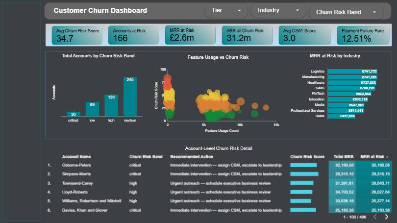
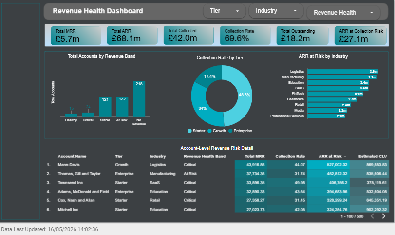
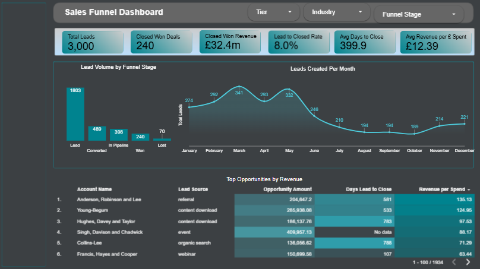
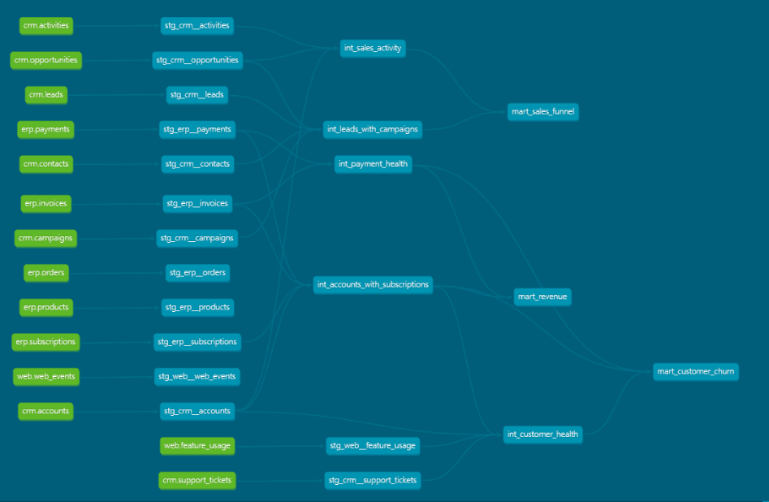

# Revenue Intelligence Platform on GCP

An end-to-end analytics platform that unifies CRM, ERP, and web event data into a layered dbt and BigQuery warehouse, surfaces three executive dashboards in Looker Studio, and exposes the same tested mart layer to a deployed conversational data agent.

The platform answers the questions a revenue team actually cares about every Monday morning:

- *Which accounts are most likely to churn, and how much revenue is at risk?*
- *How healthy is our revenue today: what's collected, what's outstanding, what's at risk?*
- *Where are leads falling out of the funnel, and which campaigns are returning real revenue?*

Built with Python, BigQuery, dbt Core, Looker Studio, MCP Toolbox, LangChain, Vertex AI, Cloud Run, and GitHub Actions. 14 staging models, 5 intermediate models, 3 mart tables, 95 automated tests, and 159 documented columns, with every change gated by CI before it reaches the mart layer.

---

## Live

**[Open the live Looker Studio report](https://datastudio.google.com/reporting/c5270921-d001-40d0-8e88-46d3bea81199)**

The conversational agent runs on Cloud Run behind authentication. Screenshots below; access available on request.

---

## Table of Contents

- [About the Project](#about-the-project)
- [Objective](#objective)
- [Approach](#approach)
- [Results](#results)
- [Dashboards](#dashboards)
- [Conversational Data Agent](#conversational-data-agent)
- [Architecture](#architecture)
- [Data Model](#data-model)
- [Pipeline Layers](#pipeline-layers)
- [dbt Documentation and Lineage](#dbt-documentation-and-lineage)
- [Data Quality and Testing](#data-quality-and-testing)
- [Continuous Integration](#continuous-integration)
- [Tech Stack](#tech-stack)
- [Project Structure](#project-structure)
- [How to Run](#how-to-run)
- [Future Enhancements](#future-enhancements)

---

## About the Project

The Revenue Intelligence Platform is a production-pattern, end-to-end modern data stack project built for a B2B SaaS business. It demonstrates the full analytics engineering workflow from raw source data through ingestion, multi-layer transformation, automated testing, live dashboards, and a governed AI agent that queries the same trusted layer.

The platform combines CRM, ERP, and web event data, modelled on HubSpot, ERPNext, and GA4 schemas, into a unified analytical layer that answers three critical revenue questions: which customers are at risk of churning, where revenue is being lost in the billing cycle, and which leads are most likely to convert through the sales funnel.

The architecture follows a strict separation of concerns. Each layer has one responsibility. Ingestion moves data faithfully. Staging cleans and standardises. Intermediate computes business logic. Marts serve precomputed, tested, trusted tables to every consumer. By the time data reaches a dashboard or an agent, it has passed 95 automated quality checks across structural integrity and behavioural invariants.

---

## Objective

To design and build a fully tested, end-to-end analytics pipeline that surfaces three critical revenue insights for a B2B SaaS business:

1. **Customer churn risk**: a quantified risk score per account combining payment health, support ticket signals, and product usage patterns
2. **Revenue health**: billing collection rates, outstanding revenue exposure, and customer lifetime value across the customer base
3. **Sales funnel performance**: full lead-to-revenue attribution with deal velocity, campaign ROI, and conversion analysis

The goal was a single trusted analytical layer that business stakeholders can interrogate, whether through a dashboard or in plain English, without relying on ad hoc SQL or manual reporting.

---

## Approach

The project follows modern data stack architectural conventions across four distinct pipeline layers, each with a single responsibility.

**Source data** was generated using a Python script producing 118,430 rows across 14 tables spanning CRM, ERP, and web event domains. Realistic dirty data patterns were deliberately introduced to simulate production conditions: orphaned records, inverted date ranges, repeat payment failures, low CSAT scores, missing conversion timestamps, and inconsistent categorical casing.

**Ingestion** is handled by a Python loader that writes the generated source tables directly into BigQuery RAW datasets. No transformations or business logic are applied at this layer.

**Transformation** is handled entirely by dbt Core across three model layers:

- **Staging** (14 models, views): one model per source table. Casts data types, standardises categorical fields, and surfaces dirty data as derived boolean flags including `is_orphaned`, `is_date_inverted`, `is_low_csat`, `is_repeat_failure`, `is_high_touch`, and `is_conversion_date_missing`.

- **Intermediate** (5 models, views): computes business logic once and reuses it across mart models. Includes multi-signal churn risk scoring, a payment health timeline with consecutive failure detection, sales engagement intensity per opportunity, and the full lead-to-campaign-to-opportunity attribution chain.

- **Marts** (3 tables): the analytical data product. Organised into three business domains: core (customer churn), finance (revenue), and marketing (sales funnel).

**Consumption** happens through two independent consumers of the same mart layer: three Looker Studio dashboards, and a conversational data agent. Neither performs business logic. Every metric is calculated, tested, and validated upstream.

**Testing** is enforced through 95 automated dbt tests covering structural validation (uniqueness, not nulls, accepted values, referential integrity) and behavioural invariants (temporal ordering, business logic assertions) using the dbt_utils package.

---

## Results

| Outcome | Metric |
|---------|--------|
| Source tables modelled | 14 |
| Rows ingested across all tables | 118,430 |
| Staging models built | 14 |
| Intermediate models built | 5 |
| Mart tables materialised | 3 |
| Automated data tests | 95 |
| Documented mart columns | 159 |
| Data quality defects surfaced by documentation | 5 |
| Test runtime | Under 60 seconds |
| Dashboard pages delivered | 3 |
| Independent mart consumers | 2 |

The platform produces three production-grade analytical outputs:

- A churn risk score (0 to 100) per account with MRR and ARR at risk quantified by risk band, alongside a recommended action per account
- A revenue health classification per account combining collection rate, payment health, and subscription status with estimated customer lifetime value
- A full sales funnel view tracking every lead through campaign attribution, conversion, opportunity stage, and closed-won outcome, with deal velocity and campaign ROI

---

## Dashboards

### Customer Churn Dashboard



Tracks 496 accounts across CSAT, support tickets, feature-usage decay, and payment failures to produce a single churn risk score and band per account. Surfaces the 166 accounts at risk, ranks the roughly £2.6m MRR and £31.2m ARR exposed to churn, and pairs every account with a recommended action: immediate intervention, executive business review, proactive check-in, or monitor.

### Revenue Health Dashboard



A finance-grade view of the book of business: £5.7m MRR and £68.1m ARR across 500 accounts, with a 69.6% collection rate and £18.2m outstanding. Accounts are classified into revenue health bands (Healthy, Stable, At Risk, Critical, No Revenue) by combining collection rate and payment health, with an estimated CLV computed per account from MRR and average subscription duration.

### Sales Funnel Dashboard



Lead-to-close visibility across 3,000 leads, 240 closed-won deals, and £32.4m in closed-won revenue. Tracks lead volume by funnel stage, monthly lead creation seasonality, average days to close (399.9), and revenue per £ spent (£12.39), broken down by lead source, channel, and campaign so marketing knows what is actually paying back.

---

## Conversational Data Agent

A deployed AI agent that answers questions about the mart layer in plain English, grounded in the same tested and documented models that feed the dashboards.

Ask "which tier has the highest average churn risk" and it inspects the table's documented column meanings, writes SQL, runs it, and returns an answer alongside the query that produced it.

### Grounding

The agent does not see the data while it reasons. It sees the schema.

All 159 mart columns are documented in `schema.yml` with business meaning, unit and scale, grain, permitted values for categorical fields, and what NULL signifies. `persist_docs` writes those descriptions into BigQuery as table metadata, where the agent reads them before composing any query.

Writing those definitions surfaced five data quality defects that had been feeding dashboards undetected, including an aggregate returning the alphabetically last text value rather than the most recent record.

### Governance

Enforced at three layers, and tested rather than assumed:

- **IAM**: the Toolbox service account holds BigQuery Data Viewer on the `marts` dataset only. Staging, intermediate, and raw are unreachable.
- **Tool configuration**: `writeMode: blocked` permits SELECT only. `allowedDatasets` is checked by a pre-execution dry run. `maximumBytesBilled` caps scan cost per query. Parameters are validated against allowed values.
- **System prompt**: the agent must inspect a table's documentation before writing SQL against it, and must say so plainly when the marts cannot answer a question rather than constructing a plausible substitute.

Verified by negative testing: queries reaching outside `marts` are rejected before execution, writes are refused, and invalid parameter values are rejected at the server rather than silently returning zero rows.

### Transparency

Every answer displays the SQL that ran, read from the recorded tool calls in the message history rather than from the model's own account of what it did.

### Components

| Component | Role |
|---|---|
| BigQuery | Stores the mart tables and their column metadata |
| MCP Toolbox | Exposes the marts as a fixed set of read-only tools (Cloud Run) |
| Vertex AI (Gemini) | Interprets the question, chooses tools, writes SQL, composes the answer |
| LangChain | Runs the tool loop and binds the tools to the model |
| Streamlit | Chat interface (Cloud Run) |

Two Cloud Run services, each running as its own least-privilege service account. The model never holds credentials; the tool layer never makes decisions.

---

## Architecture

```
                    ┌────────────────────────────────────────────┐
                    │   Synthetic source generation (Python)     │
                    │   CRM · ERP · Web event schemas            │
                    └─────────────────────┬──────────────────────┘
                                          │
                    ┌─────────────────────▼──────────────────────┐
                    │            Raw data (BigQuery)             │
                    └─────────────────────┬──────────────────────┘
                                          │
                                  dbt sources.yml
                                          │
                    ┌─────────────────────▼──────────────────────┐
                    │            staging (views)                 │
                    │   stg_crm__*  ·  stg_erp__*  ·  stg_web__* │
                    │   typed, cleaned, renamed                  │
                    └─────────────────────┬──────────────────────┘
                                          │
                    ┌─────────────────────▼──────────────────────┐
                    │           intermediate (views)             │
                    │   int_customer_health                      │
                    │   int_payment_health                       │
                    │   int_accounts_with_subscriptions          │
                    │   int_sales_activity                       │
                    │   int_leads_with_campaigns                 │
                    └─────────────────────┬──────────────────────┘
                                          │
                    ┌─────────────────────▼──────────────────────┐
                    │        marts (tables) · 95 tests           │
                    │   core/mart_customer_churn                 │
                    │   finance/mart_revenue                     │
                    │   marketing/mart_sales_funnel              │
                    └───────────┬────────────────────┬───────────┘
                                │                    │
                ┌───────────────▼──────┐   ┌─────────▼─────────────┐
                │   Looker Studio      │   │  MCP Toolbox          │
                │   3 dashboards       │   │       ↓               │
                │                      │   │  LangChain + Vertex   │
                │                      │   │       ↓               │
                │                      │   │  Streamlit (Cloud Run)│
                └──────────────────────┘   └───────────────────────┘
```

---

## Data Model

14 source tables across three domains:

| Domain | Tables |
|--------|--------|
| CRM | accounts, contacts, leads, opportunities, activities, campaigns, support_tickets |
| ERP | products, orders, invoices, subscriptions, payments |
| Web | web_events, feature_usage |

### Deliberate data quality issues introduced

| Issue | Table | Flag |
|-------|-------|------|
| Contacts with no linked account | contacts | is_orphaned |
| Converted leads with no converted_at | leads | is_conversion_date_missing |
| Subscriptions where end_date < start_date | subscriptions | is_date_inverted |
| Activities with null activity_date | activities | is_date_missing |
| Support tickets with no CSAT score | support_tickets | flagged in derived column |
| Consecutive failed payments | payments | is_repeat_failure |
| Inconsistent utm_source casing | web_events | standardised in staging |

---

## Pipeline Layers

### Staging (14 models, views)

One model per source table. Responsibilities:

- Cast all columns to correct data types
- Standardise categorical fields using `LOWER(TRIM())`
- Rename columns to project conventions
- Derive dirty data flags as boolean columns
- No joins, no aggregations, no business logic

Organised into three subfolders matching source domains.

### Intermediate (5 models, views)

| Model | Purpose |
|-------|---------|
| int_accounts_with_subscriptions | Account-level subscription, invoice, and payment aggregations: MRR, ARR, collection rate, payment failure rate |
| int_customer_health | Multi-signal churn risk scoring per account, producing a 0 to 100 score and band |
| int_payment_health | Payment timeline analysis with consecutive failure detection and payment health band |
| int_sales_activity | Sales engagement intensity per opportunity: call, meeting, demo, and email counts, reps involved, positive-outcome rate |
| int_leads_with_campaigns | Lead to campaign to opportunity attribution chain with budget utilisation and conversion timing |

### Marts (3 tables)

| Model | Folder | Purpose |
|-------|--------|---------|
| mart_customer_churn | marts/core | Churn risk score, MRR/ARR at risk, recommended action per account |
| mart_revenue | marts/finance | Revenue health classification, collection rate, net revenue, outstanding %, estimated CLV |
| mart_sales_funnel | marts/marketing | Funnel conversion, deal velocity, campaign spend, revenue per £ spent, engagement quality |

---

## dbt Documentation and Lineage

The full dbt project documentation is auto-generated from model SQL files and `schema.yml` descriptions. The lineage graph shows the complete data flow from raw source tables through staging and intermediate transformations to the final mart tables.



To regenerate the documentation site locally:

```bash
dbt docs generate
dbt docs serve
```

This builds a browsable static site at `http://localhost:8080` with every model documented, including compiled SQL, column descriptions, test results, and an interactive lineage explorer.

---

## Data Quality and Testing

95 automated dbt tests across all three model layers, all passing.

| Test Type | Category | What it Validates |
|-----------|----------|-------------------|
| unique | Structural | Primary keys are unique |
| not_null | Structural | Critical columns are never null |
| accepted_values | Structural | Categorical fields contain only valid values |
| relationships | Structural | Foreign key integrity across model references |
| dbt_utils.expression_is_true | Behavioural | Business logic assertions on derived metrics |

Behavioural tests use the `dbt_utils` package and validate logical invariants between columns. For example, asserting that `days_lead_to_close` cannot be negative because a deal cannot close before its lead was created. These tests catch nonsense outputs that pass structural validation.

Tests run in under 60 seconds and replace manual data validation entirely.

Separately, documenting all 159 mart columns surfaced five real defects that testing alone had not caught, including an aggregate whose name promised the most recent value while returning the alphabetically last one.

---

## Continuous Integration

Every push that touches a model, macro or project config triggers a GitHub
Actions workflow that rebuilds the entire pipeline from source and runs all
95 tests. A failure fails the build.

### Isolation

CI never writes to production. A `generate_schema_name` macro prefixes every
schema with the target's dataset for any target other than `dev`, so a CI run
builds into `ci_staging`, `ci_intermediate` and `ci_marts` while reading real
source data from `raw`. A broken model cannot overwrite a good mart before the
tests catch it.

### Authentication

The workflow authenticates to Google Cloud through Workload Identity
Federation. GitHub issues a short-lived token asserting which repository the
run belongs to, Google verifies it against a trust scoped to this repository
alone, and returns a temporary credential. No service account key exists and
nothing long-lived is stored in GitHub secrets.

### What it caught

The first run failed. `stg_crm__campaigns` referenced a `campaign_variant`
column that does not exist in the source table, and had been sitting in the
repo unnoticed because local runs had never rebuilt that model from scratch.
Nineteen downstream models and tests were skipped as a result.

That is the argument for CI in one example: a clean-machine rebuild surfaces
what a developer's own environment quietly hides.

---

## Tech Stack

| Layer | Tool |
|-------|------|
| Source schemas modelled on | HubSpot (CRM), ERPNext (ERP), GA4 (web events) |
| Data generation and ingestion | Python (Faker) |
| Data warehouse | BigQuery (GCP) |
| Transformation | dbt Core |
| Testing | dbt_utils |
| Visualisation | Looker Studio |
| Agent tool layer | MCP Toolbox |
| Agent orchestration | LangChain |
| Model hosting | Vertex AI (Gemini) |
| Agent interface | Streamlit on Cloud Run |
| CI | GitHub Actions with Workload Identity Federation |
| Version control | Git, GitHub |

---

## Project Structure

```
revenue_intelligence_platform/
├── models/
│   ├── staging/
│   │   ├── sources.yml
│   │   ├── schema.yml
│   │   ├── crm/          # 7 staging models
│   │   ├── erp/          # 5 staging models
│   │   └── web/          # 2 staging models
│   ├── intermediate/
│   │   ├── schema.yml
│   │   └── int_*.sql     # 5 intermediate models
│   └── marts/
│       ├── schema.yml    # 159 documented columns
│       ├── core/mart_customer_churn.sql
│       ├── finance/mart_revenue.sql
│       └── marketing/mart_sales_funnel.sql
├── agent/
│   ├── app.py                     # Streamlit UI
│   ├── main.py                    # Agent definition, system prompt, terminal client
│   ├── tools.shared.yaml          # Source config + curated fixed-SQL tools
│   ├── tools.analyst-extra.yaml   # Discovery tools + open-ended query
│   ├── Dockerfile                 # Streamlit service
│   ├── Dockerfile.toolbox         # MCP Toolbox service
│   └── requirements.txt
├── .github/
│   └── workflows/
│       └── dbt_ci.yml         # Build and test on every model change
├── seeds/
├── snapshots/
├── tests/
├── macros/
├── analyses/
├── images/
├── dbt_project.yml
├── packages.yml
└── README.md
```

---

## How to Run

### Prerequisites

- Python 3.9 or above
- A Google Cloud project with BigQuery enabled
- A service account with BigQuery Data Editor and Job User roles
- dbt-bigquery installed: `pip install dbt-bigquery`

### Setup

```bash
git clone https://github.com/Promchi/revenue-intelligence-platform-on-gcp.git
cd revenue-intelligence-platform-on-gcp/revenue_intelligence_platform

dbt deps
dbt debug
dbt build
```

### Example `profiles.yml`

```yaml
revenue_intelligence_platform:
  target: dev
  outputs:
    dev:
      type: bigquery
      method: service-account
      project: your-gcp-project-id
      dataset: analytics_dev
      keyfile: /absolute/path/to/service-account-key.json
      threads: 4
      location: EU
```

### Run by layer

```bash
dbt run --select staging
dbt run --select intermediate
dbt run --select marts
dbt run --select tag:finance
dbt test --select mart_customer_churn
```

### Run the agent locally

```bash
cd agent
gcloud auth application-default login
./toolbox --configs tools.shared.yaml,tools.analyst-extra.yaml --ui
python main.py
```

---

## Future Enhancements

- **Push dashboard measures into the marts**: calculated fields currently defined in Looker Studio should move into the model layer so both consumers share one metric definition
- **Continuous deployment**: extend the existing GitHub Actions setup to build and deploy the agent container on push, reusing the same federated identity
- **BigQuery ML layer**: train a churn prediction model on the mart tables to produce statistically derived probabilities alongside the rule-based risk score
- **Persistent agent memory**: replace the in-memory checkpointer with a Postgres-backed one so conversations survive restarts
- **Incremental loading**: convert mart models to incremental materialisations for production-scale data volumes

---

*Built by Promise | [LinkedIn](https://www.linkedin.com/in/promise-ezeike) | [GitHub](https://github.com/promchi)*